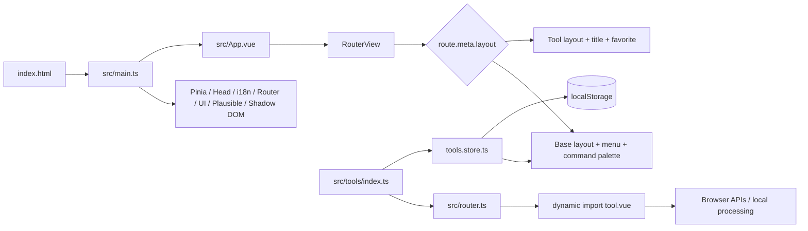

# IT Tools Architecture

Current-state review: 2026-08-07. Exact accepted test/build measurements and
the recovery checkpoint live in `.ai/PROGRESS.md` and `.ai/HANDOFF.md`.
Audit-time comparisons are explicitly labeled historical below and must not be
used to restart completed work.

## 1. Purpose and system boundaries

The project is a static single-page application and PWA containing browser-based utilities for developers. The current branch registers 89 tools across 10 categories. There is no application backend: transformations, parsing, generation, cryptography, and file handling run in the user's browser.

The production artifact is the `dist/` directory. It can be served by Vercel, Netlify, any static host, or nginx in the Docker image. Plausible is the only built-in external telemetry integration and is disabled by default; its URLs are path-only. ASCII Art fonts are versioned same-origin assets, opened tool chunks/workers are demand-cached, and tools that intentionally require browser network/system APIs retain their own disclosed boundaries.

## 2. Technology stack

| Layer | Technologies | Responsibility |
|---|---|---|
| Language and UI | TypeScript 5.2, Vue 3.3, SFC | Components and reactive business logic |
| Build | Vite 4.4, vue-tsc, pnpm 9.11 | Type checking, code splitting, production bundle |
| Routing | Vue Router 4, HTML5 history | Home, About, 89 tool routes, redirects, and 404 |
| State | Pinia, VueUse `useStorage` | Theme, menu, favorites, and local tool preferences |
| UI system | Naive UI, UnoCSS, custom `c-*` components | Layout, forms, cards, tables, and themes |
| Icons | `@vicons/tabler`, `@vicons/material`, `@tabler/icons-vue`, unplugin-icons/MDI | Shell and tool icons |
| i18n | vue-i18n, unplugin-vue-i18n | Compiled YAML messages; this fork retains English only |
| PWA | vite-plugin-pwa, Workbox | Manifest, service worker, offline cache, auto-update |
| Unit tests | Vitest, jsdom, Vue Test Utils | Services, models, composables, and selected UI |
| E2E tests | Playwright | Chromium, Firefox, and WebKit scenarios |
| Delivery | GitHub Actions, Docker, nginx, Vercel, Netlify | CI, release artifacts, and static hosting |

Specialized libraries are grouped around individual tools: JSON5/YAML/TOML/XML/Markdown/SQL, `crypto-js`/`bcryptjs`/`node-forge`/BIP39, `@noble/hashes`, `mathjs`, `monaco-editor`, TipTap, `libphonenumber-js`, generated OUI data, QR/PDF/UA parsers, and others. `package.json` currently contains 65 runtime and 47 development dependencies.

## 3. Repository structure

```text
.
├── src/
│   ├── main.ts                 # application bootstrap and plugins
│   ├── App.vue                 # theme/providers + layout selection + RouterView
│   ├── router.ts               # routes generated from the tool registry
│   ├── config.ts               # typed environment configuration
│   ├── tools/                  # 89 isolated tools
│   │   ├── index.ts            # central registry and categories
│   │   ├── tool.ts             # defineTool and isNew calculation
│   │   ├── tools.store.ts      # localization, categories, favorites
│   │   └── <tool>/             # index, Vue UI, service/model, tests
│   ├── ui/                     # low-level c-* component library
│   ├── components/             # shared product components
│   ├── layouts/                # base and tool layouts
│   ├── pages/                  # Home, About, 404
│   ├── modules/                # command palette, i18n, tracker
│   ├── stores/                 # global UI state
│   ├── composable/             # validation, copy, query params, etc.
│   ├── plugins/                # i18n, Naive UI, Plausible
│   └── utils/                  # small pure helpers
├── locales/en.yml              # current consolidated message catalog
├── scripts/                    # tool scaffolding, locales, release/changelog
├── public/                     # favicons, manifest assets, robots/humans
├── .github/workflows/          # CI, E2E, releases
├── vite.config.ts              # Vite/Vitest/PWA/plugins
├── unocss.config.ts            # utility CSS
├── playwright.config.ts        # three browsers and preview server
├── Dockerfile / nginx.conf     # multi-stage static image
└── .ai/                        # handoff, current status, audits, baselines, snapshots
```

## 4. Runtime flow



### Bootstrap

`src/main.ts` registers the service worker before mounting, then installs Pinia, document head management, i18n, the router, the Naive plugin, Plausible, and Shadow DOM support. `App.vue` selects a layout from `route.meta`, configures the Naive UI theme, and synchronizes the locale with `localStorage`.

### Routes and registry

`src/tools/index.ts` statically imports every tool's `index.ts` and groups descriptors into categories. A descriptor contains `name`, `path`, `description`, `keywords`, an icon component, and `component: () => import('./tool.vue')`.

This creates a mixed loading model:

- the UI and heavy libraries of a specific tool are normally loaded lazily;
- metadata, `defineTool`, translations, and 89 icon components enter the application shell;
- Home and 404 are eager, while About and tool components are dynamic;
- the router, side menu, favorites, and command palette all consume the same registry.

The central registry is convenient but is also a major source of initial-bundle weight and merge conflicts when tools are added in parallel.

### Layout and navigation

`base.layout.vue` contains the responsive side menu, command palette, navigation buttons, and footer. `tool.layout.vue` adds the tool title, description, and favorite action. `MenuLayout.vue` manages collapsed state and the mobile overlay. The Home page renders favorite, new, and all tools; favorite tools can be reordered by drag-and-drop.

### State and persistence

- `style.store.ts`: dark theme, mobile media query, and collapsed menu state.
- `tools.store.ts`: translated descriptors, categories, favorite paths, and favorite order.
- Command palette store: a snapshot of options and a Fuse search index.
- `useStorage`: audited presentation preferences such as theme, menu, favorites,
  formatter settings, and generator configuration.
- Tool content is session-only by default. Startup removes thirteen legacy
  content/network-input keys, and Regex never writes editor changes back to
  URL/history.
- Text Diff is the sole content-persistence exception: default-off, explicit,
  versioned, debounced, clearable, and bounded to 256 KiB per side.
- Secrets, uploaded files, generated tokens, private keys, and OTP seeds remain
  ephemeral. Analytics receives path-only URLs and sanitized referrers.

The full key inventory, migration behavior, denial residual, and browser
evidence are authoritative in `.ai/PERSISTENCE.md`.

## 5. Architecture of a tool

The expected tool module is:

```text
src/tools/example/
├── index.ts                    # descriptor + lazy import + icon
├── example.vue                 # UI orchestration
├── example.service.ts          # pure transformation/integration
├── example.service.test.ts     # unit tests
├── example.e2e.spec.ts         # route/user flow
├── example.types.ts            # optional types
└── components/                 # optional local UI
```

`scripts/create-tool.mjs` creates this skeleton and inserts an import into the shared registry, but the category must still be added manually. `scripts/build-locales-files.mjs` imports `bun:Glob`, while Bun is not pinned as part of the main toolchain and the script is not exposed through package scripts.

## 6. Build and code splitting

Vite uses Vue/JSX/Markdown/SVG, auto-import, auto-components, icon generation, UnoCSS, i18n, and PWA plugins. The target is `esnext`, so legacy browsers are not a supported target.

Accepted schema-v4 production evidence for implementation checkpoint `5f7e97a`:

| Metric | Current value |
|---|---:|
| Transformed modules | 24,192 |
| Local Vite phase | 21.17 s |
| `dist/` | 511 files / 13,329,332 B raw / 3,812,444 B gzip |
| Shell including document | 902,309 B raw / 276,963 B gzip |
| Mandatory Workbox install | 9 entries / 956,157 B raw / 327,325 B gzip |
| Text Diff route + owned-worker closure | 2,474,507 B raw / 646,976 B gzip |
| MAC Lookup route + owned-worker closure | 1,937,384 B raw / 770,467 B gzip |
| File Hash route + owned-worker closure | 70,260 B raw / 26,677 B gzip |
| File Hash worker | 25,899 B raw / 10,417 B gzip |

The nine-entry Workbox shell is enforced at no more than 1 MB raw, 350 kB
gzip, and ten files. Lazy tool chunks, route-owned workers, and 289 same-origin
Figlet fonts are cached only after use. Production offline tests cover a generic
lazy route, uncached-route recovery, and File Hash route/worker reuse after the
HTTP cache is cleared.

`scripts/build-stats.mjs` discovers manifest graphs and literal route-owned
workers, then applies rationale-backed shell, route, worker, and mandatory-PWA
budgets. The accepted artifact passes 202 checks; schema behavior passes 16
infrastructure tests. Raw baseline details remain in
`.ai/baselines/build-stats.json` and `.ai/PERFORMANCE.md`.

The main sources of weight are four icon mechanisms, eager registry metadata/icons, CommonJS `lodash` across 41 source imports, Monaco, the full OUI dataset, full `mathjs`, emoji datasets, TipTap, and overlapping parser/rendering libraries.

## 7. Test architecture and current quality

- The accepted integrated checkpoint passes zero-warning lint and both the
  application/test and Vite-config typecheck projects.
- 816/816 unit tests pass across 104 files.
- 102/102 sequential Chromium E2E tests pass, including the registry-generated
  smoke for all 89 routes.
- Sixteen build-stat infrastructure tests, 202 current-artifact budget checks,
  and four generated-OUI checks pass.
- Production browser gates cover privacy/storage, worker cancellation and route
  disposal, large structured inputs, File Hash 256 MiB behavior, PWA demand
  caching/recovery, and lifecycle/heap regressions.
- Playwright remains configured for Chromium, Firefox, and WebKit and CI shards
  the suite. The source host did not have the pinned Firefox/WebKit binaries for
  the latest File Hash feature smoke, so that cross-browser claim remains open.
- Bundle/PWA/container budgets and all-route smoke are executable CI/release
  gates. Coverage thresholds and full axe coverage remain separate backlog.

## 8. CI/CD and operations

### CI

`ci.yml` resolves Node from `.nvmrc` (`24.18.0`), enables Corepack, installs
with `--frozen-lockfile`, and runs lint, unit tests, build-stat tests, OUI
freshness, both typecheck projects, production build, and artifact budgets. A
separate container job builds the pinned image and runs rootless static-delivery
contracts. The E2E workflow uses the same Node/lockfile contract, installs the
pinned Playwright browsers, and shards the suite across three jobs.

### Docker

The multi-stage Dockerfile uses digest-pinned Node 24.18.0/Alpine 3.23 and
`nginxinc/nginx-unprivileged` 1.30.3/Alpine 3.23 images. Corepack resolves the
package-manager pin; `pnpm fetch` plus offline frozen install makes the build
reproducible. The final image runs as UID/GID 101 by default, also passes an
arbitrary-UID contract, supports a configurable internal port, and is tested
with a read-only root filesystem, dropped capabilities, and writable tmpfs.

nginx enables compression, immutable caching for hashed assets, no-cache rules
for documents/service-worker files, security headers, strict static 404s, SPA
fallback, health checks, and access logs that omit query strings and referrers.
Reverse-proxy and real base/subpath deployment acceptance remain open.

### Releases

A `v*.*.*` tag publishes multi-architecture images to Docker Hub and GHCR and
creates a draft GitHub release with a ZIP of `dist`. Release ordering,
permissions, frozen installs, artifact budgets, Chromium smoke, SBOM, and
provenance declarations are present. Building once and reusing one artifact
across every delivery target remains a throughput/provenance improvement.

## 9. Security and privacy boundary

All user information remains inside the SPA origin unless an individual tool
explicitly discloses a network/system boundary. Sensitive tool content is
session-only by default; analytics is path-only; Text Diff persistence is the
sole bounded, explicit, default-off content exception.

Attacker-controlled Regex, Bcrypt, JSON/YAML, schema validation, hashing, and
OUI work now use bounded worker/lifecycle contracts where implemented. Monaco
models/workers, media tracks, object URLs, timers, and shared layout ownership
have disposal regressions. Shared large-output rendering bounds DOM expansion,
while the complete accepted output can still remain in memory and must retain
per-tool byte limits.

Important residuals remain: DOM-dependent Regex SVG, parser/download-policy
consolidation, preference-storage denial, slower-device/cross-browser coverage,
and any tool not yet migrated to the bounded execution policy. Ajv performs
runtime validator code generation, so a future eval-blocking CSP requires a
precompiled/interpreted design rather than `unsafe-eval`.

Advisory counts recorded by the original audit are historical snapshots, not a
current vulnerability report. Dependency/base-image remediation and scanner
gating are deliberately deferred to a separate security track under the
current scope; no advisory suppression has been added. Do not restart that
track from this architecture document without explicit product direction.

## 10. Fork and upstream state

The current working branch is `feat-ai-research`; the local fork and its reviewed `.ai` roadmap remain the source of truth. Upstream issues and pull requests are requirements research only unless an adaptation is explicitly approved and recorded.

The portable implementation checkpoint for the 2026-08-07 handoff is
`5f7e97aa4ee538d54c87605d8ad7c0e9f79486f5` on
`origin/feat-ai-research`; recovery and ancestry rules live in
`.ai/HANDOFF.md`. Session-specific branch/HEAD facts belong there rather than
being treated as permanent architecture.

The original audit compared upstream `main` at `d505845` with the then-current
local history. That divergence is historical research, not a merge plan or a
current ahead/behind claim. The useful native-`size` behavior from upstream
`#1552` has already been adapted locally with regression coverage; no upstream
history was cherry-picked.

The complete upstream snapshot is stored in:

- `.ai/issues/issues.json`: 710 issues, including 486 open issues;
- `.ai/prs/pull-requests.json`: 997 PRs, including 327 open and 493 merged PRs.

Future development should move the local architecture forward. Any upstream borrowing must be listed explicitly in `.ai/TODO.md`, verified with tests, and adapted intentionally rather than synchronized wholesale.
