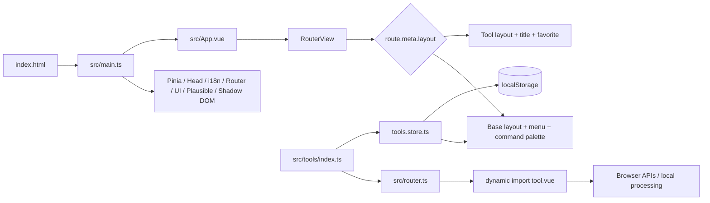

# IT Tools Architecture

## 1. Purpose and system boundaries

The project is a static single-page application and PWA containing browser-based utilities for developers. The current branch registers 86 tools across 10 categories. There is no application backend: transformations, parsing, generation, cryptography, and file handling run in the user's browser.

The production artifact is the `dist/` directory. It can be served by Vercel, Netlify, any static host, or nginx in the Docker image. Plausible is the only built-in external telemetry integration and is disabled by default. The application is not completely network-independent today: the ASCII Art tool fetches fonts from a CDN, while the PWA/service worker and browser APIs have their own network and system boundaries.

## 2. Technology stack

| Layer | Technologies | Responsibility |
|---|---|---|
| Language and UI | TypeScript 5.2, Vue 3.3, SFC | Components and reactive business logic |
| Build | Vite 4.4, vue-tsc, pnpm 9.11 | Type checking, code splitting, production bundle |
| Routing | Vue Router 4, HTML5 history | Home, About, 86 tool routes, redirects, and 404 |
| State | Pinia, VueUse `useStorage` | Theme, menu, favorites, and local tool preferences |
| UI system | Naive UI, UnoCSS, custom `c-*` components | Layout, forms, cards, tables, and themes |
| Icons | `@vicons/tabler`, `@vicons/material`, `@tabler/icons-vue`, unplugin-icons/MDI | Shell and tool icons |
| i18n | vue-i18n, unplugin-vue-i18n | Compiled YAML messages; this fork retains English only |
| PWA | vite-plugin-pwa, Workbox | Manifest, service worker, offline cache, auto-update |
| Unit tests | Vitest, jsdom, Vue Test Utils | Services, models, composables, and selected UI |
| E2E tests | Playwright | Chromium, Firefox, and WebKit scenarios |
| Delivery | GitHub Actions, Docker, nginx, Vercel, Netlify | CI, release artifacts, and static hosting |

Specialized libraries are grouped around individual tools: JSON5/YAML/TOML/XML/Markdown/SQL, `crypto-js`/`bcryptjs`/`node-forge`/BIP39, `mathjs`, `monaco-editor`, TipTap, `libphonenumber-js`, `oui-data`, QR/PDF/UA parsers, and others. `package.json` currently contains 67 runtime and 43 development dependencies; several build-only and type-only packages are incorrectly placed in `dependencies`.

## 3. Repository structure

```text
.
├── src/
│   ├── main.ts                 # application bootstrap and plugins
│   ├── App.vue                 # theme/providers + layout selection + RouterView
│   ├── router.ts               # routes generated from the tool registry
│   ├── config.ts               # typed environment configuration
│   ├── tools/                  # 86 isolated tools
│   │   ├── index.ts            # central registry and categories
│   │   ├── tool.ts             # defineTool and isNew calculation
│   │   ├── tools.store.ts      # localization, categories, favorites
│   │   └── <tool>/             # index, Vue UI, service/model, tests
│   ├── ui/                     # low-level c-* component library
│   ├── components/             # shared product components
│   ├── layouts/                # base and tool layouts
│   ├── pages/                  # Home, About, 404
│   ├── modules/                # command palette, i18n, tracker
│   ├── stores/                 # global UI state
│   ├── composable/             # validation, copy, query params, etc.
│   ├── plugins/                # i18n, Naive UI, Plausible
│   └── utils/                  # small pure helpers
├── locales/en.yml              # current consolidated message catalog
├── scripts/                    # tool scaffolding, locales, release/changelog
├── public/                     # favicons, manifest assets, robots/humans
├── .github/workflows/          # CI, E2E, releases
├── vite.config.ts              # Vite/Vitest/PWA/plugins
├── unocss.config.ts            # utility CSS
├── playwright.config.ts        # three browsers and preview server
├── Dockerfile / nginx.conf     # multi-stage static image
└── .ai/                        # audit results and upstream snapshots
```

## 4. Runtime flow



### Bootstrap

`src/main.ts` registers the service worker before mounting, then installs Pinia, document head management, i18n, the router, the Naive plugin, Plausible, and Shadow DOM support. `App.vue` selects a layout from `route.meta`, configures the Naive UI theme, and synchronizes the locale with `localStorage`.

### Routes and registry

`src/tools/index.ts` statically imports every tool's `index.ts` and groups descriptors into categories. A descriptor contains `name`, `path`, `description`, `keywords`, an icon component, and `component: () => import('./tool.vue')`.

This creates a mixed loading model:

- the UI and heavy libraries of a specific tool are normally loaded lazily;
- metadata, `defineTool`, translations, and 86 icon components enter the application shell;
- Home and 404 are eager, while About and tool components are dynamic;
- the router, side menu, favorites, and command palette all consume the same registry.

The central registry is convenient but is also a major source of initial-bundle weight and merge conflicts when tools are added in parallel.

### Layout and navigation

`base.layout.vue` contains the responsive side menu, command palette, navigation buttons, and footer. `tool.layout.vue` adds the tool title, description, and favorite action. `MenuLayout.vue` manages collapsed state and the mobile overlay. The Home page renders favorite, new, and all tools; favorite tools can be reordered by drag-and-drop.

### State and persistence

- `style.store.ts`: dark theme, mobile media query, and collapsed menu state.
- `tools.store.ts`: translated descriptors, categories, favorite paths, and favorite order.
- Command palette store: a snapshot of options and a Fuse search index.
- `useStorage`: preferences and some user content, including JSON/YAML/diff/WYSIWYG/case data.
- Query parameters: URL plus `localStorage` synchronization for selected tools.

Persistence has no common schema version, size limits, migration mechanism, or sensitivity policy. Large text writes to `localStorage` are synchronous; Text Diff additionally writes its content on every Monaco model change.

## 5. Architecture of a tool

The expected tool module is:

```text
src/tools/example/
├── index.ts                    # descriptor + lazy import + icon
├── example.vue                 # UI orchestration
├── example.service.ts          # pure transformation/integration
├── example.service.test.ts     # unit tests
├── example.e2e.spec.ts         # route/user flow
├── example.types.ts            # optional types
└── components/                 # optional local UI
```

`scripts/create-tool.mjs` creates this skeleton and inserts an import into the shared registry, but the category must still be added manually. `scripts/build-locales-files.mjs` imports `bun:Glob`, while Bun is not pinned as part of the main toolchain and the script is not exposed through package scripts.

## 6. Build and code splitting

Vite uses Vue/JSX/Markdown/SVG, auto-import, auto-components, icon generation, UnoCSS, i18n, and PWA plugins. The target is `esnext`, so legacy browsers are not a supported target.

Measured production build for the current branch:

| Metric | Value |
|---|---:|
| Transformed modules | 24,599 |
| Build time | 51.16 s |
| `dist/` | 13 MB |
| Initial JS | 853.13 kB raw / 266.28 kB gzip |
| Initial CSS | 32.55 kB raw / 6.84 kB gzip |
| PWA precache | 270 entries / 5,940.03 KiB |
| `mac-address-lookup` | 3,347.31 kB / 1,065.98 kB gzip |
| `text-diff` JS | 3,160.91 kB / 804.42 kB gzip |
| `text-diff` CSS | 112.42 kB / 18.28 kB gzip |
| `math-evaluator` | 623.24 kB / 180.12 kB gzip |
| `html-wysiwyg-editor` | 489.30 kB / 153.92 kB gzip |

Workbox does not precache the two chunks above its default size limit (`mac-address-lookup` and `text-diff`), but it precaches almost every other lazy chunk. Installing the PWA therefore downloads about 5.9 MB even if the user needs one tool.

The main sources of weight are four icon mechanisms, eager registry metadata/icons, CommonJS `lodash` across 41 source imports, Monaco, the full OUI dataset, full `mathjs`, emoji datasets, TipTap, and overlapping parser/rendering libraries.

## 7. Test architecture and current quality

- 33 unit-test files and 138 tests pass.
- 26 E2E spec files and 61 Chromium tests pass.
- Playwright is also configured for Firefox and WebKit; CI shards the full suite across three jobs.
- The production build passes.
- `pnpm lint` currently fails with 9 errors and 6 warnings, mostly stale imports left after local UI/sponsor/i18n removal.
- `pnpm typecheck` currently fails on two nullable accesses in `c-diff-editor.vue`; `pnpm build` uses a different tsconfig path and does not expose these, while CI runs the separate typecheck.
- There are no coverage thresholds, bundle budgets, performance tests, accessibility scans, dependency/container release gates, or mandatory smoke tests for all 86 routes.

## 8. CI/CD and operations

### CI

`ci.yml` runs install, lint, unit tests, type checking, and build on Node 20 for pushes to `main` and pull requests. Installation does not use `--frozen-lockfile`. The E2E workflow builds the application, installs Playwright browsers, and runs sharded tests.

The Playwright cache key reads the nonexistent `.dependencies.playwright`; the actual package is `@playwright/test` under `devDependencies`. This produces an invalid key and reduces cache effectiveness.

### Docker

The multi-stage Dockerfile performs these steps:

1. use mutable `node:lts-alpine`;
2. install unpinned pnpm globally with npm;
3. install from the lockfile and build;
4. use mutable `nginx:stable-alpine`;
5. copy `dist` and configure SPA fallback.

`.nvmrc` (18.18.2), CI (20), the audited local runtime (22), and Docker `node:lts` disagree. The nginx config does not define gzip/Brotli, immutable caching, separate no-cache rules for `index.html`/`sw.js`, security headers, a health check, or a non-root runtime. For self-hosted Docker this affects reproducibility, security, and network performance.

### Releases

A `v*.*.*` tag publishes multi-architecture images to Docker Hub and GHCR and creates a draft GitHub release with a ZIP of `dist`. The image and ZIP are built independently; without provenance or an SBOM, artifact equivalence is not guaranteed.

## 9. Security and privacy boundary

All user information lives in the SPA origin. This reduces server-side exposure but leaves important browser-side risks:

- XSS can read all `localStorage`, including persisted JSON, diffs, and HTML;
- regex, YAML/JSON/XML, Markdown, PDF, and crypto process untrusted input and can block the main thread;
- synchronous bcrypt recomputes on input and allows 100 rounds;
- document parsing has no shared size, depth, or timeout policy;
- object URLs and Monaco models are not always released;
- dependencies and container bases are substantially outdated.

The current `pnpm audit` reported 125 unique advisories: 4 critical, 45 high, 66 moderate, and 10 low. With repeated dependency paths, metadata reports 5 critical, 47 high, 77 moderate, and 12 low occurrences. Exploitability must be triaged individually, but `crypto-js`, `node-forge`, `lodash`, `yaml`, DOMPurify, and vue-i18n are direct dependencies and require priority updates.

## 10. Fork and upstream state

The current branch is `feat-store-state` at `9805ce2`. It contains three local commits on top of local `main` (`08d977b`) and intentional changes: persistence for selected tools, removal of sponsor/UI elements, demo routes, issue templates, and most locales.

Upstream `main` was `d505845` at audit time. Local `main` is four upstream commits behind (`#1552`, `#1553`, `#1664`, `#1733`), while the feature branch diverges by three local versus four upstream commits. Sponsor changes are already superseded by the local line. The only substantive code candidate among those four is the logic from `#1552`, which prevents UnoCSS attributify from treating native HTML `size` as a utility; it should be adapted manually instead of cherry-picked.

The complete upstream snapshot is stored in:

- `.ai/issues/issues.json`: 710 issues, including 486 open issues;
- `.ai/prs/pull-requests.json`: 997 PRs, including 327 open and 493 merged PRs.

Future development should move the local architecture forward. Any upstream borrowing must be listed explicitly in `.ai/TODO.md`, verified with tests, and adapted intentionally rather than synchronized wholesale.
